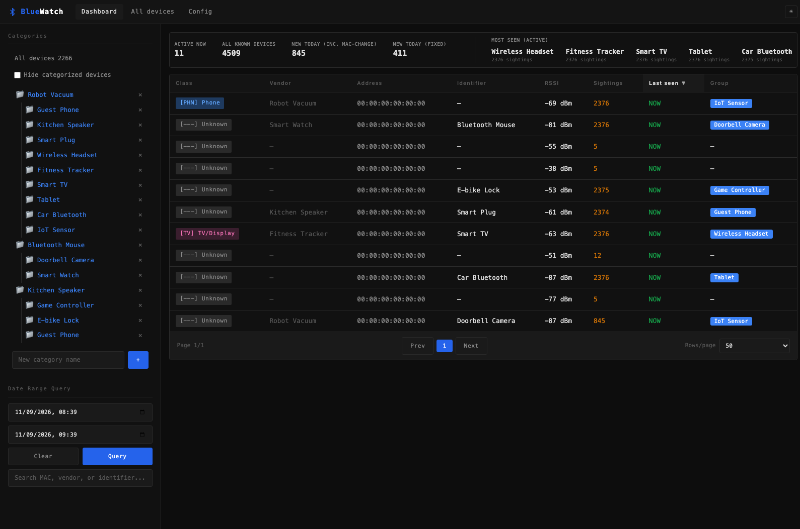
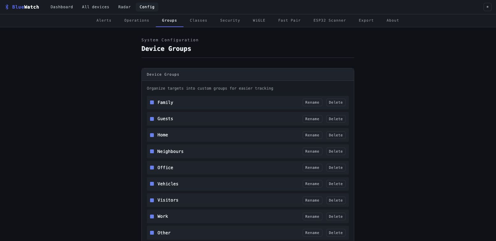
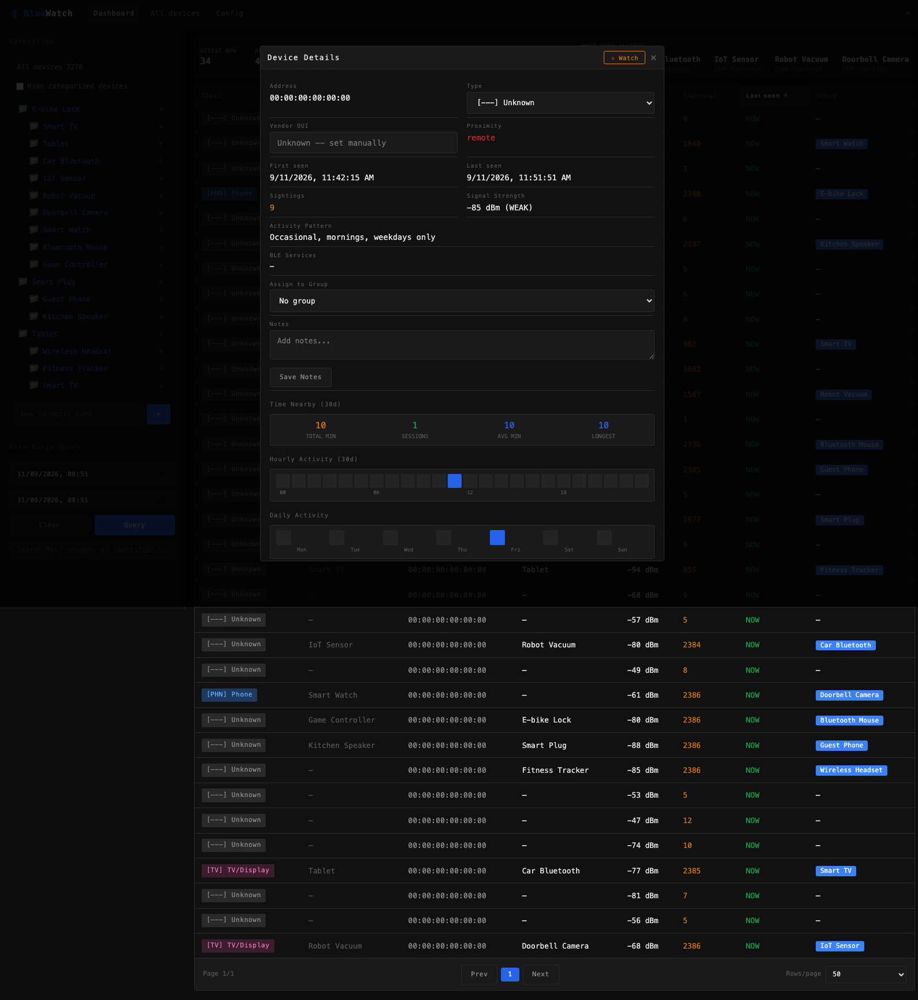

<p align="center">
  
</p>

# BlueWatch

Get alerts when new Bluetooth devices appear in your local neighbourhood.

The real strength shows up once you actually start using it: categorize
the devices you already know, your own phones, your TV, the smart
plugs, the neighbour's robot lawnmower, whatever's expected around
you, and BlueWatch filters all of that familiar traffic out of the
way. What's left standing out is the interesting part: the moment an
unrecognized device enters the radio range of whatever's running
BlueWatch, it surfaces immediately instead of being buried under dozens
of devices you've already triaged. The dashboard stops being a wall of
MAC addresses and turns into an actual presence radar for your
surroundings. You notice the one device that doesn't belong, not the
fifty that do.

Started from [bluehood](https://github.com/dannymcc/bluehood) (MIT licensed, see `CREDITS.md`) but has since diverged into its own project: known/
unknown device triage, user-defined nested categories with drag-and-drop
assignment, per-device arrive/depart notification overrides, an
independent watchlist, a live "nearby now" dashboard, IRK-based address
resolution, and a WiGLE.net vendor-lookup fallback, among other things
not in the original. See `SPEC.md` for the original design notes and
`CREDITS.md` for the full breakdown of what's inherited vs. new.

---

> **WARNING: Alpha Software**
>
> This project is in early development and is **not ready for production use**. Features may change, break, or be removed without notice. Use at your own risk. Data collected should be treated as experimental.

---

## Screenshots


*Live dashboard, devices seen in the last minute, with category filtering, search, and at-a-glance stats*


*Tabbed configuration page, Alerts, Operations, Groups, Security, WiGLE, and Export*


*Per-device detail view, activity heatmaps, presence timeline, signal history, notes, and category assignment*

## Why?

Thousands of Bluetooth devices surround us at all times: phones, cars, TVs, headphones, hearing aids, delivery vehicles, and more. BlueWatch demonstrates how simple it is to passively detect these devices and observe patterns in their presence, no pairing, no active interaction, nothing the device owner would ever notice.

With enough data, you could potentially:
- Understand what time someone typically walks their dog
- Detect when a visitor arrives at a house
- Identify patterns in daily routines based on device presence

This metadata can reveal surprisingly personal information without any active interaction with the devices.

I came across [bluehood](https://github.com/dannymcc/bluehood) and tried it out on a Raspberry Pi, liked the idea immediately, but ran into some gaps and features I wanted that weren't there yet. That turned into using Claude Code to grow it into its own project and take it in a somewhat different direction. Huge thanks to Danny McClelland for the work he put into the original Bluehood. None of this would exist without it.

**BlueWatch is an educational tool to raise awareness about Bluetooth privacy.** It started as a weekend project, but the implications are worth thinking about.

## What?

BlueWatch is a Bluetooth scanner that:

- **Continuously scans** for nearby Bluetooth devices (both BLE and Classic)
- **Identifies devices** by vendor (MAC address lookup) and BLE service UUIDs
- **Classifies devices** into categories (phones, audio, wearables, IoT, vehicles, etc.)
- **Tracks presence patterns** over time with hourly/daily heatmaps
- **Filters out noise** from randomized MAC addresses (privacy-rotated devices)
- **Analyzes device correlations** to find devices that appear together
- **Sends push notifications** when watched devices arrive or leave
- **Provides a web dashboard** for monitoring and analysis

## Features

### Scanning
- Dual-mode scanning: Bluetooth Low Energy (BLE) and Classic Bluetooth
- MAC address vendor lookup (local database + online API fallback)
- BLE service UUID fingerprinting for accurate device classification
- Classic Bluetooth device class parsing
- Randomized MAC filtering (hidden from main view)

### Device Management
- Mark devices as "Watched" for tracking personal devices
- Organize devices into custom groups
- Set friendly names for known devices
- Add custom notes/tags to any device
- Device type detection (phones, audio, wearables, IoT, vehicles, etc.)

### Analytics
- **30-day presence timeline** visualization
- **Signal strength (RSSI) history** chart with 7-day data
- **Hourly and daily activity heatmaps** showing when devices are active
- **Pattern analysis** ("Weekdays, evenings 5PM-9PM")
- **Dwell time analysis** showing total time devices spend in range
- **Device correlation** detection to find devices that appear together (co-presence plus synchronized arrival/departure)
- **MAC-rotation linkage** ("Likely same device"), heuristically links randomized identifiers that hand off in time, share a similar signal strength, and ping at a similar cadence
- **Proximity zones** (immediate, near, far, remote) based on signal strength
- Search by MAC, vendor, or name
- Date range search for historical queries

### Notifications (via ntfy.sh)
- Push notifications to your phone/desktop
- Notify when new devices are detected
- Notify when watched devices return
- Notify when watched devices leave
- Configurable thresholds for arrival/departure

### Operations
- **Heartbeat check-in**, periodically POST status to an uptime monitoring service (e.g., Uptime Kuma, Healthchecks.io)
- **Storage rotation**, automatically prune sightings older than a configurable number of days; optionally restrict pruning to whole stale devices seen fewer than a minimum number of times (watched devices are never pruned)
- Both configurable from the web UI or via environment variables

### Web Interface
- **Compact/Detailed view toggle** for different display preferences
- **Screenshot mode** to obfuscate MACs and names for safe sharing
- **Keyboard shortcuts** for power users (press `?` to view)
- **CSV export** of detailed device data (MAC, vendor, identifier, type, BT type, device class, watched/ignored flags, first/last seen, sightings, group, service UUIDs, and notes), exports the whole filtered set, not just the current page
- **Device groups** for organizing related devices
- **Optional authentication** to secure access

## How?

### Quick Start with Docker (Recommended)

> **Prerequisites, Linux hosts only**
>
> BlueWatch communicates with your Bluetooth adapter via BlueZ, the Linux Bluetooth stack. **BlueZ must be installed and running on the host before starting the container**. The Docker image itself does not include it.
>
> ```bash
> # Debian / Ubuntu (including Ubuntu Server)
> sudo apt install bluez
> sudo systemctl enable --now bluetooth
>
> # Arch Linux
> sudo pacman -S bluez bluez-utils
> sudo systemctl enable --now bluetooth
> ```
>
> Without BlueZ on the host you'll see an error like:
> `BLE scan error: [org.freedesktop.DBus.Error.ServiceUnknown] The name org.bluez was not provided by any .service files`

```bash
# Clone this repository, then build and start with Docker Compose
git clone <this-repo-url>
cd bluewatch
docker compose up -d --build

# View logs
docker compose logs -f
```

There's no published BlueWatch image on a container registry yet. `docker-compose.yml` builds from the `Dockerfile` in this repo.

The web dashboard will be available at **http://localhost:8080**

#### Docker Requirements

- Docker and Docker Compose
- Linux host with a **BLE-capable Bluetooth adapter** (Bluetooth 4.0+) that supports the **Central** role
- BlueZ installed and running on the host (`sudo apt install bluez && sudo systemctl enable --now bluetooth`)

> **Note**: Older adapters (Bluetooth 2.x/3.x) do not support BLE scanning. If your adapter lacks BLE Central role support, you will see: `No Bluetooth adapters with BLE 'central' role found`.

> **Note**: Docker runs in privileged mode with host networking for Bluetooth access. This is required for BLE scanning.

#### Docker Environment Variables

| Variable | Default | Description |
|----------|---------|-------------|
| `PUID` | `1000` | UID for the container user, set to match your host user (`id -u`) when using bind mounts |
| `PGID` | `1000` | GID for the container user, set to match your host group (`id -g`) when using bind mounts |
| `TZ` | UTC | Container timezone (e.g., `Europe/London`) |
| `BLUEWATCH_ADAPTER` | auto | Bluetooth adapter for BLE scanning (e.g., `hci0`) |
| `BLUEWATCH_CLASSIC_ADAPTER` | same as `BLUEWATCH_ADAPTER` | Separate adapter for classic Bluetooth scanning (e.g., `hci1`). When set to a different adapter, BLE and classic scans run concurrently. |
| `BLUEWATCH_DATA_DIR` | `/data` | Database storage directory |
| `BLUEWATCH_METRICS_PORT` | disabled | Prometheus metrics port (e.g., `9199`) |
| `BLUEWATCH_HEARTBEAT_URL` | disabled | URL to POST heartbeat check-ins (e.g., a healthchecks.io or uptime-kuma push URL) |
| `BLUEWATCH_HEARTBEAT_INTERVAL` | `300` | Seconds between heartbeat check-ins |
| `BLUEWATCH_PRUNE_DAYS` | `0` (disabled) | Auto-delete sightings older than N days to free storage |
| `BLUEWATCH_PRUNE_MIN_SIGHTINGS` | `0` (disabled) | When >0, prune whole stale devices (older than `BLUEWATCH_PRUNE_DAYS` and with fewer than N total sightings) instead of only trimming old sighting rows; watched devices are never pruned |

### Bluetooth Adapter Requirements

BlueWatch requires a **BLE-capable Bluetooth adapter** (Bluetooth 4.0 or later) with **Central** role support. Older Bluetooth 2.x/3.x adapters do not support BLE scanning and will not work.

If your adapter does not support the BLE Central role, BlueWatch will exit with:
```
No Bluetooth adapters with BLE 'central' role found
```

You can check your adapter's capabilities with `bluetoothctl show` and look for `central` in the supported roles.

### Manual Installation (Linux)

```bash
# Install system dependencies (Arch Linux)
sudo pacman -S bluez bluez-utils python-pip

# Install system dependencies (Debian/Ubuntu)
sudo apt install bluez python3-pip

# Clone and install
git clone <this-repo-url>
cd bluewatch
pip install -e .
```

#### Bluetooth Permissions

Bluetooth scanning requires elevated privileges. Choose one:

1. **Run as root** (simplest):
   ```bash
   sudo bluewatch
   ```

2. **Grant capabilities to Python**:
   ```bash
   sudo setcap 'cap_net_admin,cap_net_raw+eip' $(readlink -f $(which python))
   bluewatch
   ```

3. **Use systemd service** (recommended for always-on):
   ```bash
   sudo cp bluewatch.service /etc/systemd/system/
   sudo systemctl daemon-reload
   sudo systemctl enable --now bluewatch
   ```

### macOS

BlueWatch works natively on macOS without Docker. macOS uses CoreBluetooth instead of BlueZ, which is handled automatically by the `bleak` library.

```bash
# Clone the repository
git clone <this-repo-url>
cd bluewatch

# Create a virtual environment
python3 -m venv .venv
source .venv/bin/activate

# Install
pip install -e .

# Run
python -m bluewatch.daemon
```

The web dashboard will be available at **http://localhost:8080**

> **Note**: On first run, macOS will prompt you to allow Bluetooth access. You must grant this permission for scanning to work.

## Usage

```bash
# Start with web dashboard (default port 8080)
bluewatch

# Specify a different port
bluewatch --port 9000

# Use a specific Bluetooth adapter
bluewatch --adapter hci1

# Use separate adapters for BLE and classic scanning (concurrent)
bluewatch --adapter hci0 --classic-adapter hci1

# List available adapters
bluewatch --list-adapters

# Disable web dashboard (scanning only)
bluewatch --no-web

# Enable Prometheus metrics exporter on port 9199
bluewatch --metrics-port 9199
```

## Web Dashboard

The dashboard provides:

- **Device list** with type icons, vendor, MAC, name, sightings, last seen
- **Device filters** by type (phones, audio, IoT, etc.) and watched status
- **Search** by MAC, vendor, or name
- **Date range search** to find devices seen in a specific time window
- **Tabbed settings** page, Alerts, Operations, Groups, Security, WiGLE, and Export (direct-link via hash, e.g. `/settings#operations`)
- **Device details** modal with:
  - BLE service fingerprints
  - Hourly/daily activity heatmaps
  - 30-day presence timeline
  - Signal strength (RSSI) history chart
  - Pattern analysis
  - Dwell time statistics
  - Proximity zone indicator
  - Notes field
  - Group and type assignment

### Keyboard Shortcuts

| Key | Action |
|-----|--------|
| `/` | Focus search bar |
| `r` | Refresh device list |
| `c` | Toggle compact view |
| `w` | Toggle watch on selected device |
| `Esc` | Close modal |
| `?` | Show keyboard shortcuts |

### Screenshot Mode / Demo Mode

Two levels of redaction for sharing screenshots safely, toggled via the
browser console (`localStorage.setItem('bluewatch_screenshot_mode', 'true')`
/ `'bluewatch_demo_mode'`) or, for demo mode, a `?demo=1` URL param:
- **Screenshot mode**: partial masking, MAC addresses show only the
  first 2 octets (e.g., `AA:BB:XX:XX:XX:XX`), names show only the first
  2 characters (e.g., `Da********`)
- **Demo mode**: full redaction, every MAC becomes `00:00:00:00:00:00`,
  and names/vendors/categories are replaced with generic placeholders
  (used for this README's own screenshots)
- CSV exports also respect screenshot mode

## Push Notifications

BlueWatch can send push notifications via [ntfy.sh](https://ntfy.sh), a free, open-source notification service.

1. Create a topic at ntfy.sh (e.g., `bluewatch-myname-alerts`)
2. Subscribe to the topic on your phone using the ntfy app
3. In BlueWatch settings, enter your topic name and enable notifications
4. Configure which events trigger notifications:
   - New device detected
   - Watched device returns (after being absent)
   - Watched device leaves (not seen for X minutes)

## Data Storage

Data is stored in `~/.local/share/bluewatch/bluewatch.db` (SQLite).

Override location with environment variables:
- `BLUEWATCH_DATA_DIR` - Directory for data files
- `BLUEWATCH_DB_PATH` - Direct path to database file

> **Note**: Heartbeat and pruning settings can be configured from the web UI (Settings > Operations) or via environment variables. GUI values take priority over env vars.

## How It Works

### Device Classification

BlueWatch classifies devices using multiple signals (in priority order):

1. **BLE Service UUIDs** - Most accurate (Heart Rate = wearable, A2DP = audio, etc.)
2. **Device name patterns** - "iPhone", "Galaxy", "AirPods", etc.
3. **Vendor OUI lookup** - Apple, Samsung, Bose, etc.

### Randomized MACs

Modern devices randomize their MAC addresses for privacy. BlueWatch:
- Detects randomized MACs (locally administered bit)
- Hides them from the main device list (not useful for tracking)
- Shows a count of hidden randomized devices

### Pattern Analysis

BlueWatch analyzes sighting timestamps to detect patterns:

- **Time of day**: Morning, Afternoon, Evening, Night
- **Day of week**: Weekdays, Weekends
- **Frequency**: Constant, Daily, Regular, Occasional, Rare

Example patterns: "Daily, evenings (5PM-9PM)", "Weekdays, morning (8AM-12PM)"

### Device Correlation

BlueWatch detects devices that frequently appear together within a configurable time window. This can reveal:
- Devices owned by the same person (phone + smartwatch)
- People who travel together
- Devices that share a schedule

### Proximity Zones

Based on RSSI signal strength, devices are classified into proximity zones:
- **Immediate** (> -50 dBm): Very close, within a few meters
- **Near** (-50 to -60 dBm): Nearby, same room
- **Far** (-60 to -70 dBm): Further away, adjacent rooms
- **Remote** (< -70 dBm): Distant, at edge of detection range

### Dwell Time Analysis

Tracks how long devices spend in range by analyzing gaps between sightings. A configurable gap threshold (default 15 minutes) determines when a new "session" begins.

## Prometheus Metrics

BlueWatch can expose metrics for Prometheus scraping. Enable by setting the `BLUEWATCH_METRICS_PORT` environment variable or the `--metrics-port` CLI flag.

```bash
# Via environment variable
export BLUEWATCH_METRICS_PORT=9199

# Via CLI
bluewatch --metrics-port 9199
```

Metrics are served at `http://host:9199/metrics`.

### Available Metrics

| Metric | Type | Description |
|--------|------|-------------|
| `bluewatch_scans_total` | Counter | Total scan cycles completed |
| `bluewatch_scan_errors_total` | Counter | Scan errors (label: `scan_type`) |
| `bluewatch_sightings_total` | Counter | Total device sightings recorded |
| `bluewatch_new_devices_total` | Counter | New unique devices discovered |
| `bluewatch_last_scan_devices` | Gauge | Devices in last scan (label: `scan_type`) |
| `bluewatch_devices_total` | Gauge | Unique devices in DB (label: `bt_type`) |
| `bluewatch_devices_active` | Gauge | Devices seen in last 5 minutes |
| `bluewatch_devices_watched` | Gauge | Watched device count |
| `bluewatch_devices_ignored` | Gauge | Ignored device count |
| `bluewatch_scan_duration_seconds` | Histogram | Scan cycle duration |
| `bluewatch_device_rssi_dbm` | Histogram | RSSI distribution of BLE devices |
| `bluewatch_build_info` | Info | Version information |

### Grafana Dashboard

A ready-to-import Grafana dashboard is included at [`grafana/bluewatch-dashboard.json`](grafana/bluewatch-dashboard.json). Import it via the Grafana UI (Dashboards > Import) or the API:

```bash
curl -X POST "http://localhost:3000/api/dashboards/db" \
  -H "Authorization: Bearer <your-api-key>" \
  -H "Content-Type: application/json" \
  -d "{\"dashboard\": $(cat grafana/bluewatch-dashboard.json), \"overwrite\": true}"
```

## Troubleshooting

### No devices found
- Ensure your adapter supports BLE (Bluetooth 4.0+) with the Central role, older adapters won't work
- Ensure Bluetooth adapter is enabled: `bluetoothctl power on`
- Check adapter is detected: `bluewatch --list-adapters`
- Run with sudo if permission denied

### Docker issues

**`BLE scan error: org.freedesktop.DBus.Error.ServiceUnknown` / `The name org.bluez was not provided`**

BlueZ is not installed or not running on the host. Fix:
```bash
sudo apt install bluez          # Debian/Ubuntu
sudo systemctl enable --now bluetooth
docker compose restart
```

**General checklist:**
- Ensure BlueZ is installed on the **host** (not just in the container)
- Verify Bluetooth service is running: `systemctl status bluetooth`
- Confirm your adapter is visible: `bluetoothctl list`

## Contributing

Contributions welcome! Please open an issue or PR on GitHub.

For credit for the bluehood-era contributors whose work this project's
scanning/persistence/notification plumbing was originally built on, see
`CREDITS.md`.

## License

MIT License - See [LICENSE](LICENSE) for details.

## Disclaimer

This tool is for educational purposes only. Be mindful of privacy laws in your jurisdiction when monitoring Bluetooth devices. The author is not responsible for any misuse of this software.
